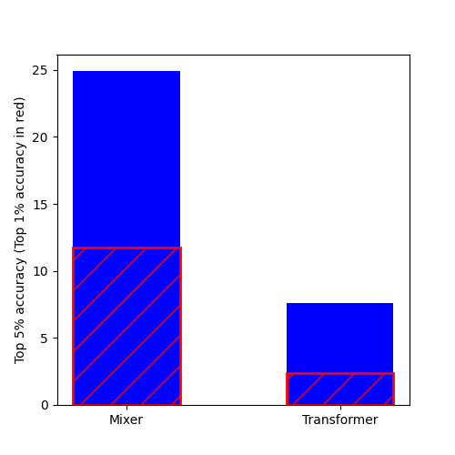
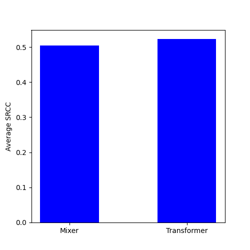

# CLIP

CLIP (Contrastive Language-Image Pre-Training) is a neural network trained on a variety of (image, text) pairs. It can be instructed in natural language to predict the most relevant text snippet, given an image, without directly optimizing for the task, similar to the zero-shot capabilities of GPT-2 and 3. We found CLIP matches the performance of the original ResNet50 on ImageNet “zero-shot” without using any of the original 1.28M labeled examples, overcoming several major challenges in computer vision.


## Approach


The encoders in the original paper are vision Transformers or ResNets. In this project, we tried encoders built with the Mixer architecture. The overall training scheme (loss, optimizer, scheduler, and hyperparameters) is the same except for the dataset which is a subset of [Laion Coco](https://laion.ai/blog/laion-coco/) of 200M samples (instead of the 400M samples in the original paper).

The Mixer is a modified Transformer where the self-attention layer is replaced with an MLP block that applies to the transposed input


## Results

We trained two models on a cluster of 8 A100 GPUs. We trained with the same parameters as in the original CLIP paper except for the dataset size which is limited to 200 million samples. We also stopped the training after 16k steps.
The Transformer-based model has 151 million parameters while the Mixer one has 111 million (a 36% increase) and they compare similarly on the STS task while the Mixer model outperforms the Transformer on the ImageNet task. The Mixer model was also roughly 25% faster to train.

We benchmarked on STS tasks (we averaged the performance on 6 benchmark datasets) to measure the performance of the text encoder and on the ImageNet classification task to test the zero-shot performance of the complete models.


|  Figure 1: Mixer vs Transformer models on the zero-shot classification task. |  Figure 2: Mixer vs Transformer models on the STS tasks (average of 6 datasets). |
|:---:|:---:|


## Usage

First, [install PyTorch 1.7.1](https://pytorch.org/get-started/locally/) (or later) and torchvision, as well as small additional dependencies, and then install this repo as a Python package. On a CUDA GPU machine, the following will do the trick:

```bash
$ conda install --yes -c pytorch pytorch=1.7.1 torchvision cudatoolkit=11.0
$ pip install ftfy regex tqdm
$ pip install git+https://github.com/openai/CLIP.git
```

Replace `cudatoolkit=11.0` above with the appropriate CUDA version on your machine or `cpuonly` when installing on a machine without a GPU.

```python
import torch
import clip
from PIL import Image

device = "cuda" if torch.cuda.is_available() else "cpu"
model, preprocess = clip.load("ViT-B/32", device=device)

image = preprocess(Image.open("CLIP.png")).unsqueeze(0).to(device)
text = clip.tokenize(["a diagram", "a dog", "a cat"]).to(device)

with torch.no_grad():
    image_features = model.encode_image(image)
    text_features = model.encode_text(text)
    
    logits_per_image, logits_per_text = model(image, text)
    probs = logits_per_image.softmax(dim=-1).cpu().numpy()

print("Label probs:", probs)  # prints: [[0.9927937  0.00421068 0.00299572]]
```


## API

The CLIP module `clip` provides the following methods:

#### `clip.available_models()`

Returns the names of the available CLIP models.

#### `clip.load(name, device=..., jit=False)`

Returns the model and the TorchVision transform needed by the model, specified by the model name returned by `clip.available_models()`. It will download the model as necessary. The `name` argument can also be a path to a local checkpoint.

The device to run the model can be optionally specified, and the default is to use the first CUDA device if there is any, otherwise the CPU. When `jit` is `False`, a non-JIT version of the model will be loaded.

#### `clip.tokenize(text: Union[str, List[str]], context_length=77)`

Returns a LongTensor containing tokenized sequences of given text input(s). This can be used as the input to the model

---

The model returned by `clip.load()` supports the following methods:

#### `model.encode_image(image: Tensor)`

Given a batch of images, returns the image features encoded by the vision portion of the CLIP model.

#### `model.encode_text(text: Tensor)`

Given a batch of text tokens, returns the text features encoded by the language portion of the CLIP model.

#### `model(image: Tensor, text: Tensor)`

Given a batch of images and a batch of text tokens, returns two Tensors, containing the logit scores corresponding to each image and text input. The values are cosine similarities between the corresponding image and text features, times 100.


## See Also

* [CLIP](https://github.com/openai/CLIP): original CLIP repo
* [OpenCLIP](https://github.com/mlfoundations/open_clip): includes larger and independently trained CLIP models up to ViT-G/14
* [Hugging Face implementation of CLIP](https://huggingface.co/docs/transformers/model_doc/clip): for easier integration with the HF ecosystem
* [[Original paper]](https://arxiv.org/abs/2103.00020), [[OpenAI blog]](https://openai.com/blog/clip/) 
